# Your Halloween Castle

<!-- For the castle's owner: print this, or send the link (the label's QR
     code opens it on GitHub). Nothing below describes a screen that does
     not exist. The pictures are docs/guide/, made from the real pages by
     `make guide-shots` (tools/guide_shots.py) — regenerate them after a
     change to a page they show. Pictures software cannot take are listed
     in comments like this one where they belong. Seller's notes are in
     docs/SUPPORT.md. -->

## Switching it on

Plug the castle's power supply into the wall. Give it about half a minute
before you try to reach it from a phone or computer. It starts quietly: the
show begins when you start it (or by itself, if you ask it to — see
**Picking a show**).

## Putting it on your Wi-Fi (the first time)

The castle does not know your Wi-Fi yet. Either way below works.

**With a phone.** Open your phone's Wi-Fi settings and join the network
called **Castle-** followed by four letters and numbers — the label on the
castle says which (for example `Castle-3F2A`). It has no password. A page
opens by itself: tap your home Wi-Fi in its list, type the password and
press **Save**. The Castle- network disappears when the castle has joined
yours. If no page opens, open a browser on the phone and go to
`http://192.168.4.1`.

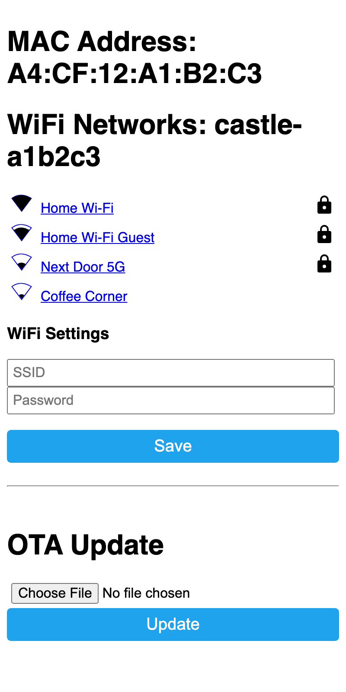

<!-- Picture still wanted (needs a phone and a castle): the phone's own
     Wi-Fi list with the Castle- network in it. -->

**With a computer and a USB-C cable.** In Google Chrome or Microsoft Edge,
open the castle's setup page, **https://jtn0123.github.io/halloween_esp/**,
plug the castle into the computer, click **Connect to the castle**, and
follow the Wi-Fi step it offers.

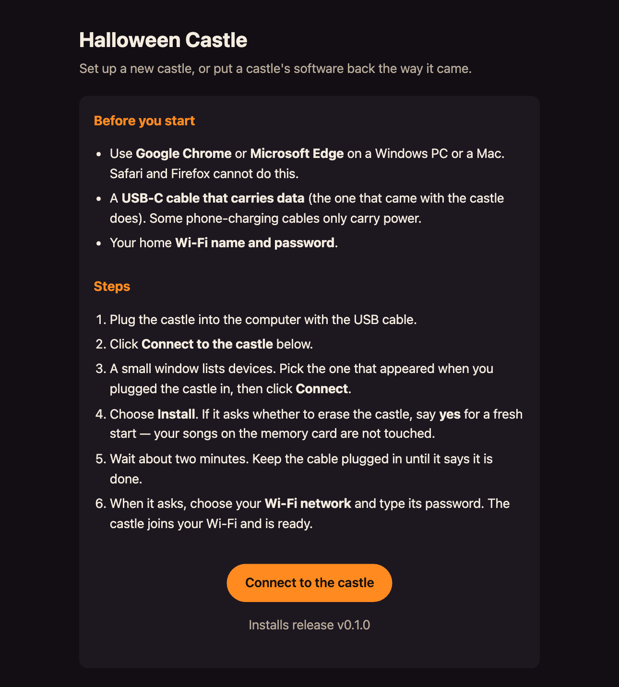

<!-- Picture still wanted (needs a castle on USB): the setup page's Wi-Fi
     step, after Install. -->

## Opening the castle's page

On a phone or computer on the same Wi-Fi, open a browser and go to the
castle's name, **http://castle-xxxxxx.local** — the label on the castle
has it written out. If the name does not open (some phones and computers
cannot look such names up), find "castle" in your router's list of
connected devices and type the number address it shows, such as
`http://192.168.1.50`; or let Castle Tools find it for you (see the end of
this guide). The castle's own page, with every setting, is always at
**http://castle-xxxxxx.local/owner**, even with no memory card in it.

## Picking a show

<!-- Seller: this section, the settings, Factory reset and the castle key
     describe the castle's OWNER page (firmware/sd_web_owner.h, v5.75),
     built into the castle: at /owner always, and at / when the card has
     no /site/ page. A card prepared with `sd_sync site` / `make publish`
     serves Castle Radio's page at / instead, which has no Settings; the
     owner page is still at /owner. Check the shipped card before printing
     (docs/SUPPORT.md, "Before a castle leaves"). -->

The castle's page has one button for each show: press one to start it, and
**Stop this scene** to stop it. **▶ Start the evening show** plays the
evening's shows one after another until **■ Stop the show**. **Blackout**
turns the lights off, and the slider sets the volume. Under **Songs on the
card**, ▶ plays one of your songs. A new castle has none yet, and says so
until you add some with Castle Tools.

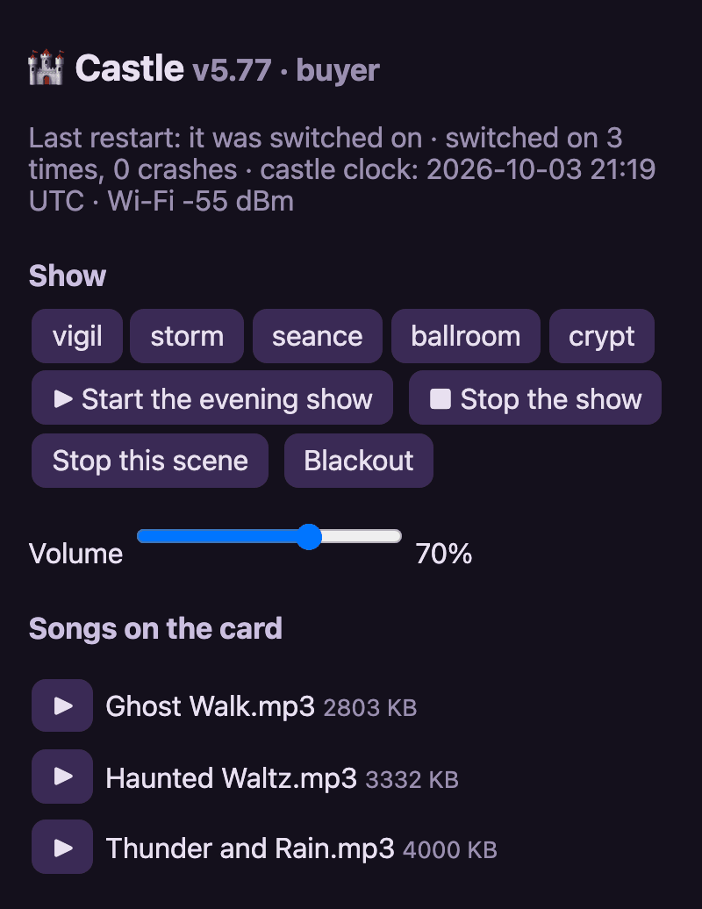
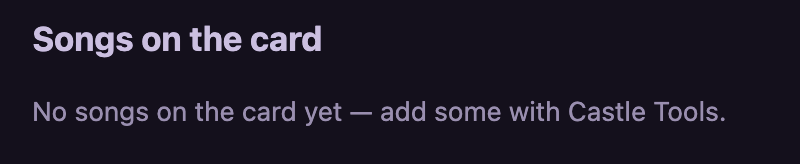

## Settings: loudness, quiet hours and the clock

Under **Settings**, all off until you save them:

- **Start the show when the castle is switched on:** tick it if you want
  the castle to begin by itself every time it is switched on.
- **Loudest the castle may ever be:** a limit in percent. Nothing on the
  page, a show or a remote can go louder.
- **Quiet hours:** tick it, pick the times, press **Save**. The castle makes
  no sound between them; the lights keep running.
- **Time zone:** pick yours so quiet hours follow your clock. The castle
  sets its clock from the internet; without internet it has no clock, and
  quiet hours never start.

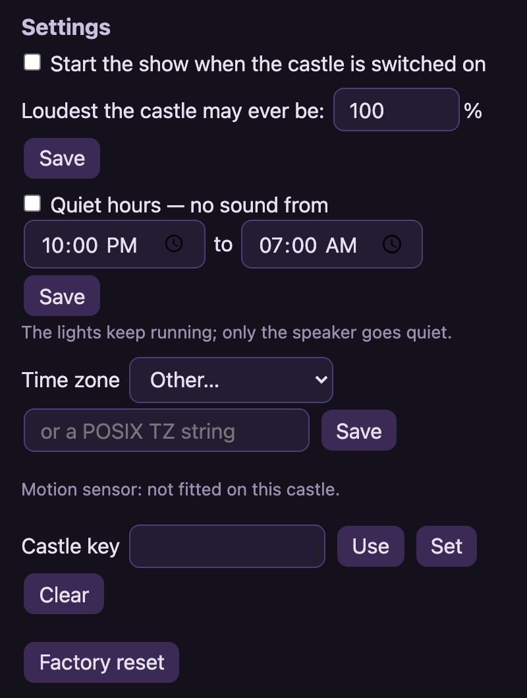

## The little light inside

There is a small light on the circuit board inside the castle.

| Light | Means |
| --- | --- |
| Blue | Starting up. |
| Orange | Installing an update. **Do not unplug it.** |
| Red | It cannot read its memory card (see below). |
| Off | All is well. |

## When something is wrong

1. **Switch it off and on.** Unplug it, count to ten, plug it back in. This
   fixes most things.
2. **The page will not open.** Check that your phone or computer is on your
   home Wi-Fi (not on mobile data, not on a guest network), then try again a
   minute after switching the castle on.
3. **New router, or a new Wi-Fi password.** Leave the castle on. After
   three minutes without its old network, the **Castle-** network comes back
   by itself: join it and set up the Wi-Fi again, as on the first day.
4. **Red light, or the page says "No SD card".** Switch the castle off,
   take the memory card out, push it back in until it clicks, and switch it
   on again.
5. **The page shows a red box about the last restart** (a crash, a power
   dip). Once is nothing. If it keeps happening, do step 6.
6. **Still stuck.** At the bottom of the castle's page, press **Report a
   problem**. It saves one text file; send that file to the person who sold
   you the castle, and say what you see.

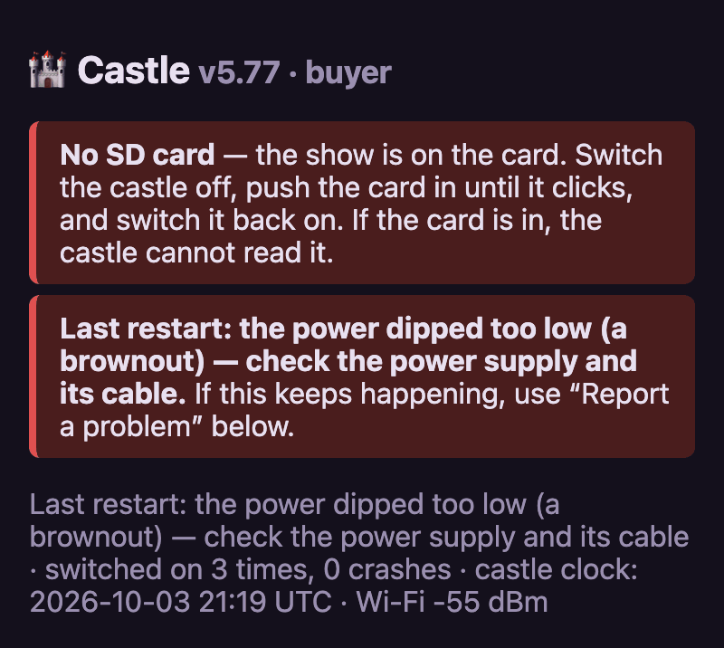
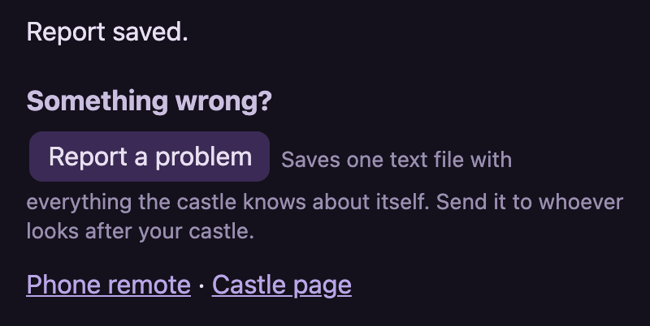

## Updating the castle

**With Castle Tools (the usual way).** Open **Your castle** and look at the
**Castle firmware** card. It shows the firmware on the castle and the
newest there is; when there is something newer, its button says **Update
castle to** and the version. Press it and leave the castle switched on: it
stops playing, takes the new firmware (the light inside turns orange) and
restarts, and the card says when it is back. Your songs and settings stay.
If the new firmware cannot start, the castle goes back to the one it had,
by itself. Nothing is ever updated unless you press the button. A castle
with a key needs the key in Castle Tools first (see **The castle key**).

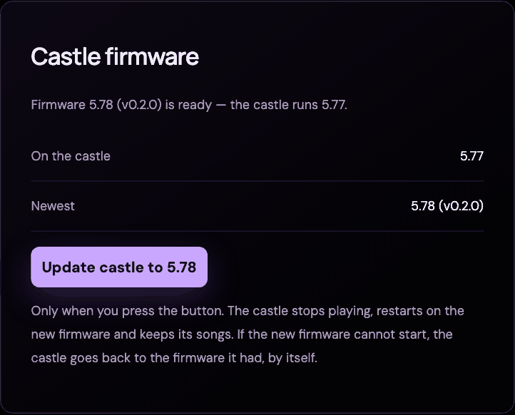

**With a USB-C cable** (when the castle will not start, or Castle Tools
cannot reach it): open **https://jtn0123.github.io/halloween_esp/** in
Chrome or Edge, click **Connect to the castle**, choose **Install**, and
keep the cable plugged in until it says it is done (about two minutes).
Your songs on the memory card are not touched. If it asks whether to erase
the castle, erasing also forgets your Wi-Fi: you will set the Wi-Fi up
again at the end.

## Factory reset

On the castle's page, under **Settings**, press **Factory reset** and confirm.
The castle forgets your Wi-Fi, its key and its settings, restarts, and puts
up its **Castle-** network so you can set it up from the beginning. Your
songs on the memory card stay.

## The castle key

A key stops anyone else on your Wi-Fi from changing the castle's settings,
songs or software; playing shows stays open to everyone. On the castle's
page, under **Settings**, type a key and press **Set**. On another phone or
computer, type it and press **Use** once. **Clear** removes it. In Castle
Tools, open **Run settings**, type the key in the **Castle key** card and
press **Use this key**; the same card can set a new key or remove it.
Forgotten it? **Factory reset** asks for the key too, so reinstall with a
USB-C cable instead (see **Updating the castle**) and choose to erase the
castle when it asks. That forgets the key, your Wi-Fi and your settings and
keeps your songs; you set up the Wi-Fi again at the end.

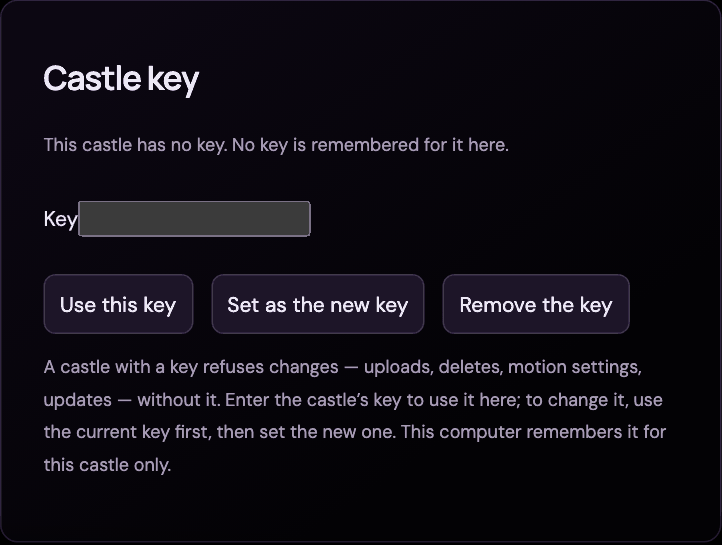

## If it will not start at all

Use the setup page with a USB-C cable (see **Updating the castle**). If the
computer cannot find the castle: try another cable (some only charge) and
another USB port. Still nothing? On the castle's circuit board, **hold the
button marked BOOT, tap the button marked RESET, then let go of BOOT**, and
click **Connect to the castle** again.

<!-- Picture still wanted (needs the board): a photo of the circuit board
     with BOOT and RESET marked. -->

## Castle Tools on your computer (adding songs)

Download it from **https://github.com/jtn0123/halloween_esp/releases/latest**:
the file ending `.dmg` for a Mac with Apple silicon (M1 or newer), or the
one ending `-setup.exe` for Windows. The app is not signed by Apple or
Microsoft, so the very first time it opens, your computer asks you to
confirm.

- **Mac:** open the `.dmg` and drag **Castle Tools** into Applications, then
  open it. When the Mac says it cannot open it, go to **System Settings →
  Privacy & Security**, scroll down, and click **Open Anyway** next to the
  line about Castle Tools; confirm with your password.
- **Windows:** run the `-setup.exe`. If a blue window says **Windows protected
  your PC**, click **More info**, then **Run anyway**.

<!-- Pictures still wanted (need the real computers): the Mac's Privacy &
     Security pane with Open Anyway; Windows SmartScreen before and after
     More info. -->

You confirm only once. After that Castle Tools looks for a newer version
when it starts and once a day, and asks before it installs one: press
**Install and restart**. Your songs stay.

**Adding a song.** The first time, **Listen** has no songs yet: press
**Import a song** (or open **Import music**), paste a link or choose a
file, and press **Import & generate show**. Castle Tools prepares the
song's light show in the background. Then, in your collection, press the
song's **⇧ Sync** button and **Sync audio + light show**: the song and its
lights go to the castle's memory card. A song marked **✓ Castle** is on the
castle, and on its page.

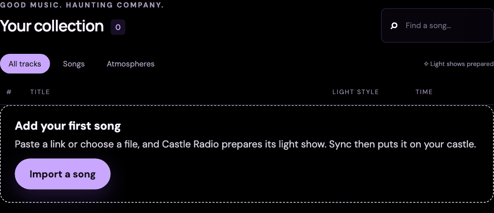
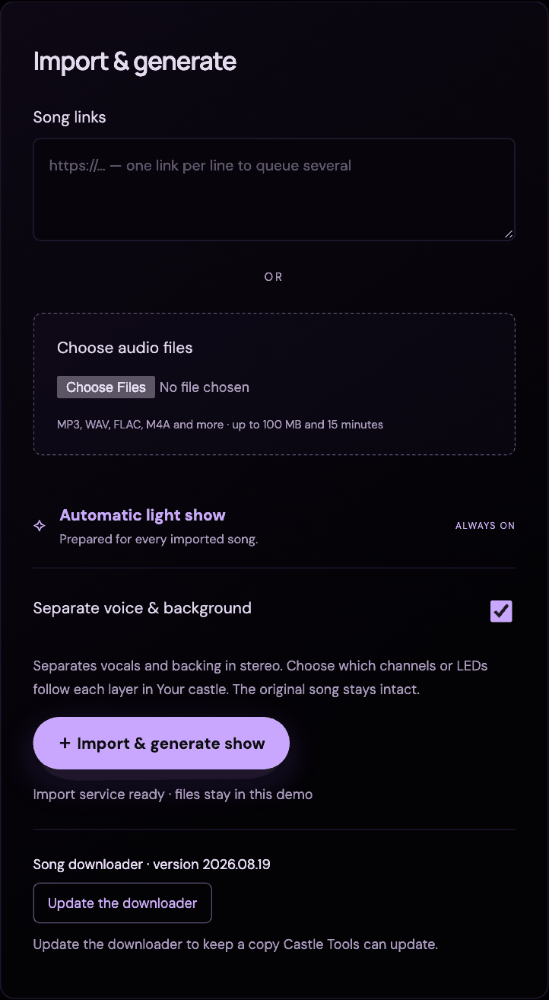

**Finding the castle.** If Castle Tools says the castle is not answering
(it is off, or your router gave it a new address), open **Your castle** and
press **⌕ Find my castle**, then **Use this castle** beside it — or type
the castle's name or number address. Everything in Castle Tools follows
whichever castle you pick.

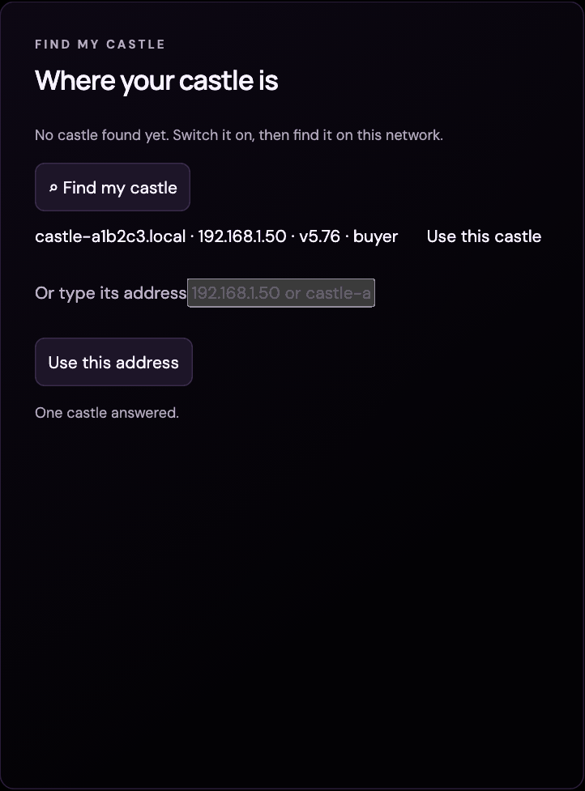

**Getting help.** On the same page, **Help with your castle** opens the
castle's own page, and **Copy diagnostics** gathers what the castle and the
app know into one text for whoever is helping you; it leaves out your
castle key and your folder names, and sends nothing.

**Which version you have.** Castle Tools shows its own (`Castle Tools
v1.2.3`) as it starts, and under **Import music → Castle Tools**. The
castle's is the firmware number on the **Castle firmware** card and on the
castle's own page. **Copy diagnostics** includes both.

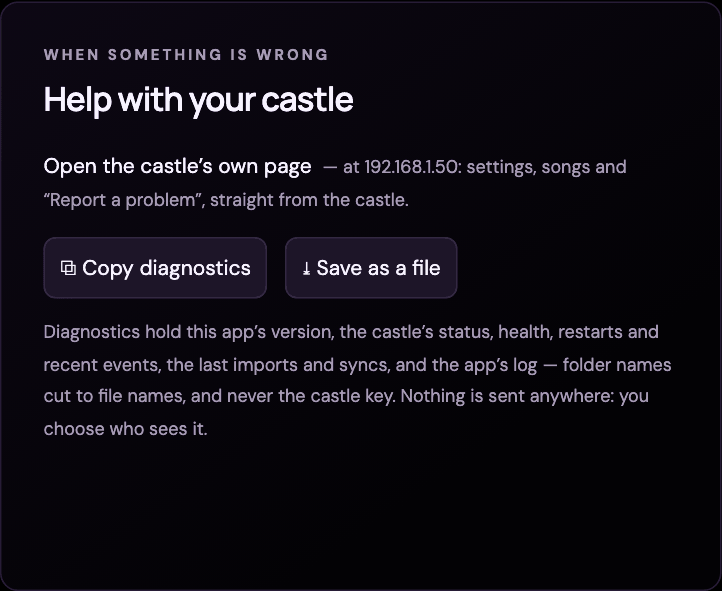

## Licences and source code

The castle's software is built from free software, some of it under the
GNU General Public License. Its memory card holds the licence notices and
a written offer of the source code, in the `licenses` folder. **Licences**
and **Source code**, at the foot of the castle's page, open them. The
source is also at **https://github.com/jtn0123/halloween_esp**.
