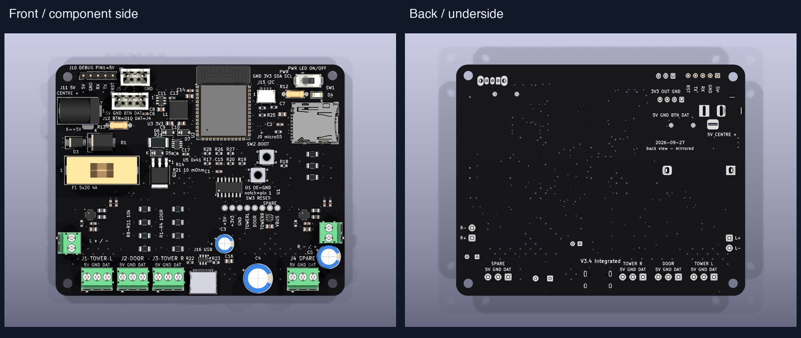
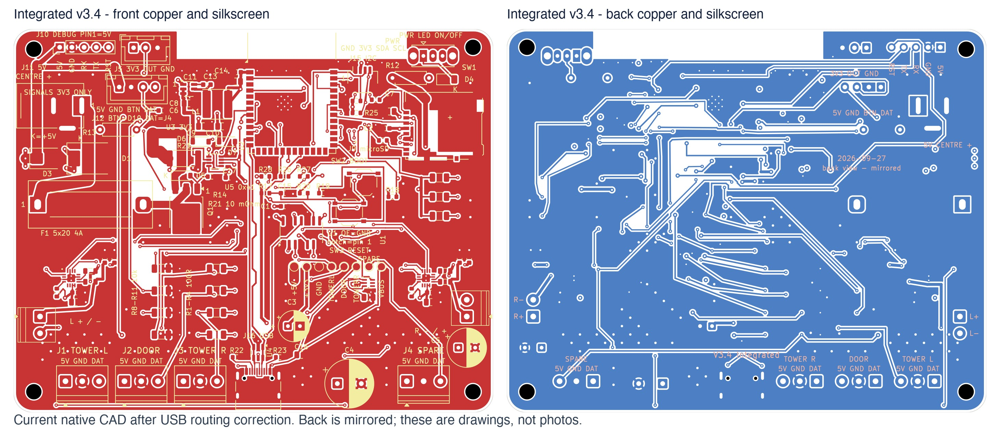

# Castle v3.4 Integrated — Mac handoff

Open `castle-carrier.kicad_pro` with **KiCad 10.0.6 or newer KiCad 10**.
This is the Integrated N16R8 prototype: 16 MB flash, 8 MB octal PSRAM,
SD storage and directly mounted LEFT/RIGHT MAX98357A amplifiers.
The native PCB is authoritative; historical bootstrap scripts cannot recreate all final edits.

## Continue on another Mac

From a checkout of `jtn0123/halloween_esp`, run
`gh pr checkout pcb/v34-integrated-enig-handoff` or check out that remote branch with Git.
Open the project in `hardware/castle-carrier-v3.4/integrated/`.
Install the standard KiCad 10 symbols, footprints and 3D models, and initialize
its standard global library tables when prompted. Custom libraries and simplified
connector/button models are included. Project tables use KiCad environment variables
instead of the old USB application path.

Run `bash validate.sh` here for package integrity, ENIG agreement, the 16-hole list,
fresh DRC with schematic parity and ERC. Set `KICAD_CLI` if KiCad is outside
`/Applications/KiCad/KiCad.app` and not on PATH. Reports go to ignored `local-checks/`.
This focused check does not reproduce the original two-variant engineering QA suite.

## Manufacturing decision

- ENIG, 1 microinch gold; four layers, 1.6 mm FR-4 TG135;
  1 oz outer / 0.5 oz inner copper.
- Exactly 16 epoxy-filled, planarized, copper-capped thermal holes:
  12 beneath the ESP32 module and two beneath each amplifier.
- JLC Standard assembly and X-ray; five boards, two assembled and three bare.
- Red or black remains an order choice. Intended supply: regulated 5 V / 4 A
  barrel adapter. The board is 100 × 80 mm.

Read [assembly notes](ASSEMBLY-NOTES.md) and
[current requirements](docs/ASSEMBLY-REQUIREMENTS.md).
Unzip [the manufacturing package](out/DFM_REVIEW_NOT_RELEASED.zip) and read
`READ-ME-FIRST.md`. It contains Gerbers, drills, engineering BOM, a placement
reference and the thermal-hole map. It remains **review only, not released**;
placement data and CAD paste layers require assembler approval.

## Current readiness

The October 7 follow-up fixes the clean-checkout validator, refreshes Integrated compilation against application commit 3078e35, and tunes both USB-C contact paths to about 0.795 mm mismatch (target <=1 mm). The revised native PCB passed refilled DRC/parity with no violations or disconnected items. The 100 x 80 mm outline, component placement, finish and 16-hole process stay the same.

C20/C21/C24/C25 now select Samsung CL10C221JB8NNNC / C27675 after comparing electrical specs and dimensions with the out-of-stock Murata part. The engineering BOM and manufacturing ZIP agree. [Stock evidence](qa/jlc-stock-20261007.json) is a dated public-page snapshot, not reserved inventory. The fuse cartridge remains a separately installed exact-MPN item.

See [readiness findings](docs/READINESS-20261007.md), [dimensioned fit drawing](out/fit-dimensions.pdf), [supplier review request](docs/SUPPLIER-REVIEW.md), and [first-board procedure](docs/FIRST-ARTICLE-TEST.md). The only given mechanical constraint is the 80-82 mm PCB-width cap; no enclosure model is assumed. The RF clearance outside the PCB is not a component body.

The [firmware overlay](firmware-reference/castle_v34.yaml) now has a [portable compilation workflow](firmware-reference/README.md), with [current build evidence](qa/firmware-build-20261007.json). Compilation is not physical playback or detected-memory proof. Printed v3.3a keeps its existing mono profile.

The archived receipt `20261002T012938Z-df738972` describes the earlier USB workspace and is historical; it does not qualify the revised USB copper or current application firmware. Keep [the archive](qa/20261002T012938Z-df738972-evidence.zip) and [ENIG source patch](qa/enig-source-update.patch) as history. The new report records fresh checks separately. The portable import manifest hashes published files, excluding KiCad local settings.

Supplier CAM/stock/orientation/stencil acceptance and powered USB, stereo, SD, combined-load/thermal and RF tests remain open. This is a prototype handoff, not a production release. No order, supplier submission, device flash or physical test was performed.

## Board views

These are CAD images. Component positions remain unchanged; current copper views include the USB correction.

More top, bottom, angled, schematic and mechanical views are in `renders/` and `out/`.
