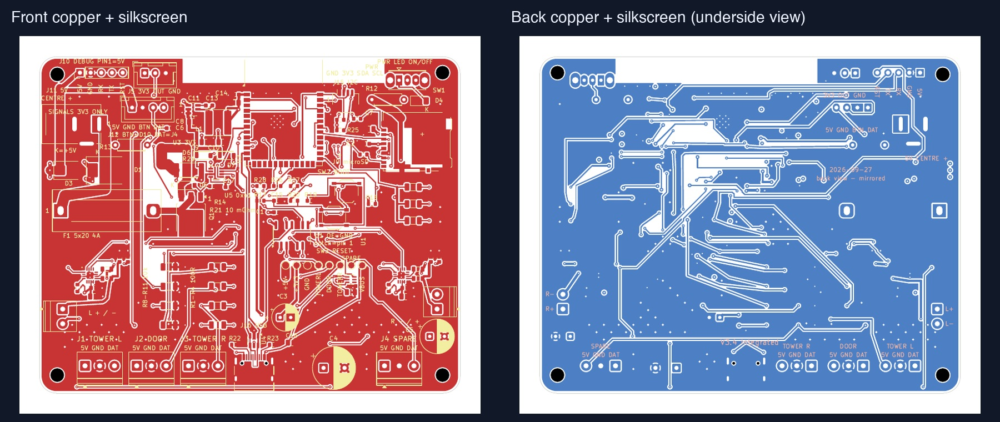

# Castle v3.4 Integrated — Mac handoff

Open `castle-carrier.kicad_pro` with **KiCad 10.0.6 or newer KiCad 10**.
This is the Integrated N16R8 prototype: 16 MB flash, 8 MB octal PSRAM,
SD storage and directly mounted LEFT/RIGHT MAX98357A amplifiers.
The native PCB is authoritative; historical bootstrap scripts cannot recreate all final edits.

## Continue on another Mac

From a checkout of `jtn0123/halloween_esp`, run
`gh pr checkout pcb/v34-integrated-enig-handoff` or check out that remote branch with Git.
Open the project in `hardware/castle-carrier-v3.4/integrated/`.
Install the standard KiCad 10 symbols, footprints and 3D models, and initialize
its standard global library tables when prompted. Custom libraries and simplified
connector/button models are included. Project tables use KiCad environment variables
instead of the old USB application path.

Run `bash validate.sh` here for package integrity, ENIG agreement, the 16-hole list,
fresh DRC with schematic parity and ERC. Set `KICAD_CLI` if KiCad is outside
`/Applications/KiCad/KiCad.app` and not on PATH. Reports go to ignored `local-checks/`.
This focused check does not reproduce the original two-variant engineering QA suite.

## Manufacturing decision

- ENIG, 1 microinch gold; four layers, 1.6 mm FR-4 TG135;
  1 oz outer / 0.5 oz inner copper.
- Exactly 16 epoxy-filled, planarized, copper-capped thermal holes:
  12 beneath the ESP32 module and two beneath each amplifier.
- JLC Standard assembly and X-ray; five boards, two assembled and three bare.
- Red or black remains an order choice. Intended supply: regulated 5 V / 4 A
  barrel adapter. The board is 100 × 80 mm.

Read [assembly notes](ASSEMBLY-NOTES.md) and
[current requirements](docs/ASSEMBLY-REQUIREMENTS.md).
Unzip [the manufacturing package](out/DFM_REVIEW_NOT_RELEASED.zip) and read
`READ-ME-FIRST.md`. It contains Gerbers, drills, engineering BOM, a placement
reference and the thermal-hole map. It remains **review only, not released**;
placement data and CAD paste layers require assembler approval.

## QA and remaining qualification

The original USB receipt `20261002T012938Z-df738972` passes for both variants.
[Archived evidence](qa/20261002T012938Z-df738972-evidence.zip) contains the receipt,
supporting summaries, Integrated reports and ENIG update report. Its paths and
hashes describe the original workspace, not a receipt for this Git checkout.
Native PCB, schematic, project, rules, custom libraries, BOM and manufacturing ZIP
are byte-preserved; project library-table paths were made portable.

The ENIG update changed finish metadata only. All 13 compared geometry exports
were unchanged. Each amplifier's paste has four 0.6 × 0.6 mm windows over a
1.5 × 1.5 mm pad (64% nominal coverage). The
[source patch](qa/enig-source-update.patch) preserves the original generator/QA
changes; those tools are not installed as a complete runnable suite here.

Supplier CAM, stock/substitution, stencil/reflow/orientation, enclosure and connector
clearances, USB signal integrity, combined power/thermal, RF, and powered
stereo/SD/Wi-Fi/light tests remain open. No physical validation, order or fabrication
release is claimed. The quoted capacitor substitution still requires approval;
the engineering BOM has not silently adopted it.

The [firmware overlay](firmware-reference/castle_v34.yaml) is a build-time reference.
Its previous compile was reverified, not rebuilt or flashed. Read its
[notes](firmware-reference/README.md) before preparing a build. Printed v3.3a keeps
its existing profile and dual-mono hardware behavior.

## Board views

These are CAD images; the finish update did not change geometry.

More top, bottom, angled, schematic and mechanical views are in `renders/` and `out/`.
