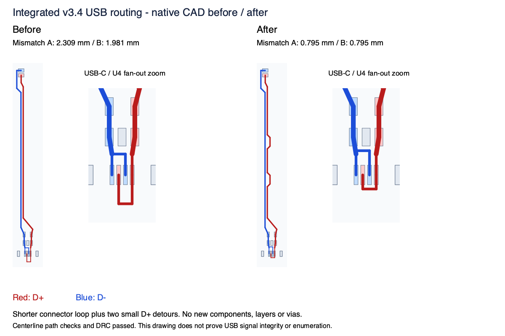
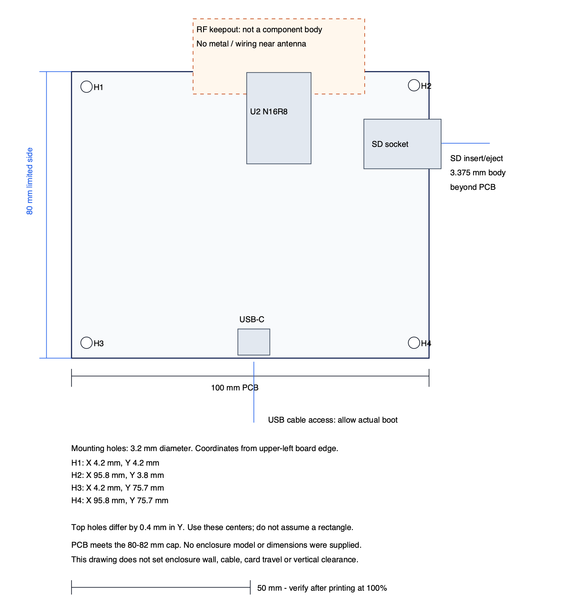

# Integrated v3.4 readiness follow-up - October 7, 2026

**Grade: B+ for a first prototype, conditional on supplier acceptance. Production readiness remains ungraded without assembled-board measurements.** The digital defects from the October 7 B-minus audit have been corrected. The user supplied only an 80-82 mm PCB-width cap; no enclosure model is assumed.

## Addressed findings

| ID | Before | Current result | Evidence |
| --- | --- | --- | --- |
| G1 | Clean checkout failed before DRC because import manifest required ignored `.kicad_prl` | Manifest regeneration uses published git files; missing/tampered handoff and package inputs still fail | `tools/check_pcb_handoff.py`, nine regression/negative controls in `tests/test_pcb_handoff.py` |
| G2 | Prior compile used older application code and ESPHome 2026.8.1 | Integrated overlay label 5.78 compiled against application 3078e35, ESPHome 2026.9.1 / IDF 5.5.5; stereo slots/pipeline, pins, codecs, 44.1 kHz resampler checked; SDK selects 16 MB flash and octal PSRAM | [Build receipt](../qa/firmware-build-20261007.json), [portable rebuild instructions](../firmware-reference/README.md) |
| G3 | Pad-aware D+/D- mismatch was 2.309 mm at A contacts and 1.981 mm at B contacts, above the <=1 mm design target | Shortened connector loop, adjusted D- bridge and added two small D+ detours; A/B mismatch about 0.795 mm; no component/via/layer increase; refilled DRC/parity passed | [USB check](../qa/usb-route-check.json), [before/after drawing](../out/usb-before-after.png) |
| G4 | Quote used an unapproved capacitor replacement and incomplete supplier codes | Four capacitor selections reconciled; exact-MPN supplier codes verified, dated public stock snapshot saved; manufacturing BOM agrees with canonical engineering BOM | [Engineering BOM](../bom-v3.4-engineering.csv), [stock snapshot](../qa/jlc-stock-20261007.json) |
| G5 | Only an 80-82 mm width limit was available | Native PCB is 100 x 80 mm; dimensioned drawing shows actual hole centers, SD body overhang and RF clearance separately | [1:1 fit drawing](../out/fit-dimensions.pdf), [fit evidence](../qa/fit-dimensions.json) |

The USB check is a native copper-centerline graph including joins within pad metal. It is neither a propagation/connector model nor an eye-diagram/compliance test. The new gate rejects the earlier layout and accepts the corrected one. Component placement, pad geometry/graphics, outline, ordinary vias and all non-USB tracks are unchanged; see [geometry comparison](../qa/geometry-preservation.json). Filled copper and USB segments were regenerated.

The Samsung CL10C221JB8NNNC / C27675 at C20/C21/C24/C25 matches the original Murata GRM1885C1H221JA01D electrical/dimensional selection: 220 pF, 50 V, C0G, +/-5%, 0603, 1.6 x 0.8 x 0.8 mm. The original supplier page showed zero stock. This is an engineering selection after comparison, not a substitution based only on nominal capacitance. Sources: [Samsung product data](https://product.samsungsem.com/mlcc/CL10C221JB8NNN.do), [Murata reference sheet](https://search.murata.co.jp/Ceramy/image/img/A01X/G101/ENG/GRM1885C1H221JA01-01.pdf), [JLC replacement stock page](https://jlcpcb.com/partdetail/C27675).

All engineering BOM parts now have a supplier code except the separately installed SCHURTER 0001.2510 fuse cartridge. The public checks show available stock for selected coded parts; inventory was not reserved. The saved snapshot includes the retired out-of-stock capacitor for comparison and repeated codes from the supplemental exact-MPN review. It is not a finalized assembler BOM match or today's assembled-board quote.

## Retained decisions and fit

- Integrated N16R8, SD GPIO39/40/41, directly mounted MAX98357A LEFT/RIGHT chips; printed v3.3a and Feather native hardware remain unchanged.
- Same regulated 5 V / 4 A barrel input; USB-C service connection. ENIG 1 microinch gold, four-layer 1.6 mm TG135, 1 oz outer / 0.5 oz inner; exactly 16 epoxy-filled, planarized, copper-capped thermal holes.
- Five boards, two assembled and three bare; red or black is a supplier quote/order choice. The trace correction adds no parts, layers or special via treatment. Earlier quoted prices are historical.
- The module body is inside the PCB. The 14.75 mm region outside its top edge is RF clearance, not a protruding body. The SD socket body extends about 3.375 mm along the uncapped dimension. Actual cable boots, card travel, enclosure walls, underside leads and height remain to be measured.
- Hole centers from upper-left board edge: H1 (4.2,4.2), H2 (95.8,3.8), H3 (4.2,75.7), H4 (95.8,75.7) mm; 3.2 mm holes. The top holes differ by 0.4 mm in Y; do not assume a rectangular mounting pattern.

## Remaining gates

1. Supplier CAM must accept the finish, stackup, exact thermal-hole map, depaneling and delivered dimensions. Approve BOM/stock, placement rotations, populated preview, stencil/reflow and required X-ray. [The request is prepared](SUPPLIER-REVIEW.md); it has not been sent or accepted.
2. Test an assembled board for USB insertion/current/backfeed and both orientations; actual detected flash/PSRAM, SD/OTA/recovery; stereo and representative decoder rates; maximum combined lights/audio/SD/Wi-Fi, thermal behavior and RF range.
3. Measure the low/hot combined-load supply margin. AP63203 requires >=3.8 V at VIN; a previous illustrative hot 4 A model was near/below that value. No measured failure is claimed, and no full-load board rating is certified. The [first-article procedure](FIRST-ARTICLE-TEST.md) sets a >=4.0 V prototype VIN margin target and a results sheet, all initially NOT RUN.

The stereo MP3 fixture was decoded/checked on the computer and is included for SD testing. Neither hardware playback nor device flashing occurred. The old QA archive is historical. Fresh full two-variant QA passed with receipt `20261008T030005Z-2490dcc6`: 2,246 delivery files verified; DRC/ERC/parity, circuit/power/layout/BOM/rules, manufacturing export comparisons, current firmware/source/image hashes, legacy preservation and the new USB endpoint check. A clean Git snapshot also passed package integrity, DRC/parity and ERC. See [the current evidence archive](../qa/20261008T030005Z-2490dcc6-evidence.zip) and [readiness summary](../qa/readiness-20261007.json). The package is review-only, not a production release.

## Current views

